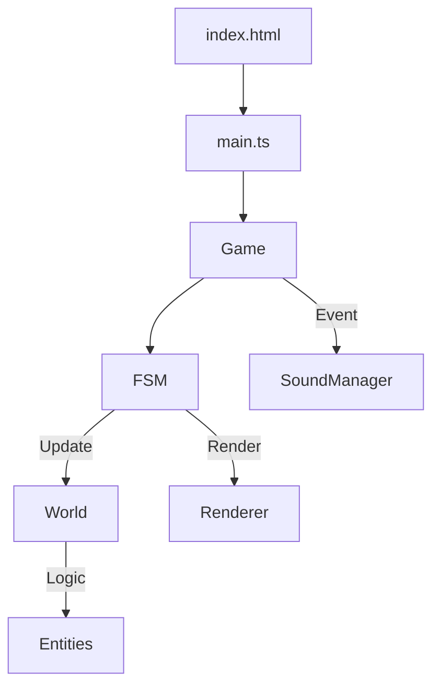

# Architecture

Project: **Defender** (Williams 1981 Arcade Clone)
Date: 2026-04-19

## Overview

The engine follows a classic game development architecture combining a **Finite State Machine (FSM)** for high-level flow and a **Component-lite Physics/Rendering** model.

## Core Design Patterns

### 1. Finite State Machine (FSM)
Managed by `src/states/state-machine.ts`. The `Game` class registers 4 primary states:
- **Attract**: Title screen with high-score display and cycling colors.
- **Playing**: Main gameplay loop.
- **Death**: Brief pause and explosion animation when the player loses a life.
- **GameOver**: Final score display.

### 2. Fixed-Timestep Accumulator
Located in `src/game.ts`. Ensures consistent physics across variable display refresh rates.
- Physics updates happen at a locked 60 FPS (`FRAME_TIME = 16.67ms`).
- Rendering happens as fast as the browser's `requestAnimationFrame` allows.

### 3. State-Driven World
The `World` class (`src/world/world.ts`) is a pure state container for all entities. It handles:
- **Entity Lifecycles**: Spawning/killing Landers, Mutants, Baiters, Bombers, Pods, Swarmers, and Humanoids.
- **Horizontal Wrapping**: A ~2000px wide world that wraps seamlessly using the `wrapX` helper.
- **Collision Detection**: Spatial checks between lasers, player, and enemies.

## Module Responsibilities

| Class/Module | Primary Responsibility |
|--------------|-------------------------|
| `Game` | Orchestrator. Manages scoring, wave progression, and state transitions. |
| `World` | Physics and Entity AI. Updates positions and resolves collisions. |
| `Renderer` | Visual output. Rasterizes world state into the 2D Canvas context. |
| `SoundManager` | Audio synthesis. Triggers Web Audio oscillators based on game events. |
| `InputManager` | Buffer-less keyboard state tracking. |

## Data Flow

